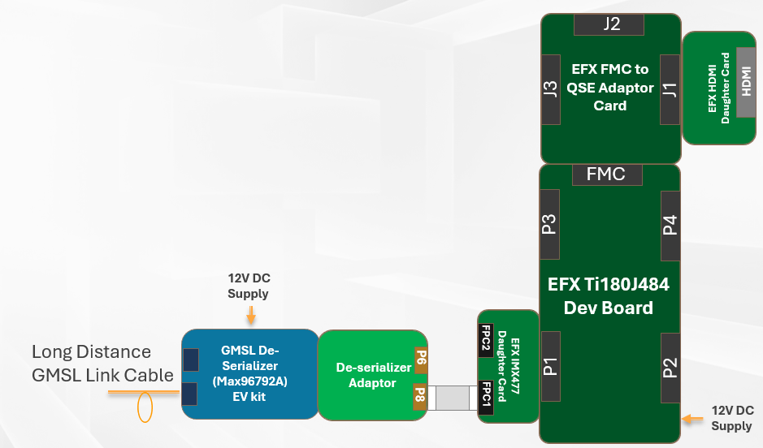

# Setup GMSL Sensors Hub

This guide show on how to setup the development boards for HDMI Display. This setup only applicable for Titanium Ti180J484 development board. 

## Overall hardware required: 

HDMI Dispaly related hardware are needed in the following:
- USB type-C cable 
- Universal AC to DC power adapter
- [Titanium Ti180J484 Development Kit](https://www.efinixinc.com/docs/ti180j484-devkit-ug-v1.7.pdf) 
- [FMC-to-QSE Adapter card](https://www.efinixinc.com/docs/fmc-qse-adapter-card-ug-v1.1.pdf)
- [HDMI Connector Daughter Card](https://www.efinixinc.com/docs/hdmi-connector-card-ug-v1.1.pdf)
- HDMI cable

## Steps for connecting the hardware to Ti180J484 Development Board and ADI GMSL Serilaizer EVK 

1. Attach the FMC to QSE Adaptor Card to FMC connector of TI180J484 Dev Board. 
2. Attach the chain of the ADI GMSL De-Serializer to QSE Connector P1. [Go to Setup Guide of GMSL Serializer to Efinix Dev Board](setup_gmsl_deserializer.md)
3. Ensure all boards have the followings jumper settings:

| **Board**                            | **Header**                  | **Pins to Connect**                               |
|--------------------------------------|-----------------------------|---------------------------------------------------|
| Titanium Ti180J484 Development Board | J9                                                                               | N.C.                                               |
|                                      | J10, J11, J12, J13, PT1, PT17                                                    | 1 - 2 and 3 - 4                                    |
|                                      | PT2, PT3, PT4, PT5, PT6, PT7, PT8, PT9, PT10, PT11, PT12, PT13, PT14, PT15, PT16 | 1 - 2                                              |
| FMC-to-QSE Adapter Card              | J5                                                                               | 5 - 6 and 7 - 8                                    |

## Configuration of the Efinix Dev Boards 

1. Download the latest Efinity Software  and install to PC. 
2. Open Efinity and click start the programmer. 
3. Choose the USB Target (i.e., Titanium Ti180 J484 Development Board). 
4. Choose the SPI Active using JTAG Bridge (New) programming mode.
5. In the Image box, click the Select Image File button and find the precomplied bitstream Combine_Efx_GMSL_HDMI_Display.hex in [quick start folder](../quick_start/Combine_Efx_GMSL_HDMI_Disiply.hex).
6. Turn on the Auto configure JTAG Bridge Image option. 
7. Ensure that the Starting Flash Address is set to 0x000000. Click Start Program button. The Programmer will configure the FPGA to JTAG Bridge mode and then program the flash device