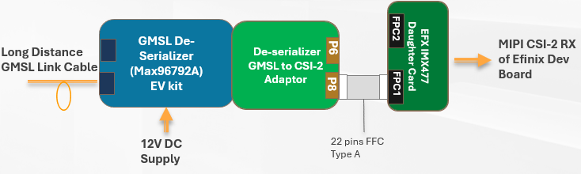

# Connection Chain of ADI GMSL Serializer to Efinix Dev Board 

1. To Enable I2C connection Between the GMSL De-Serializer and  SOC.   
    - Shost the pad of resistors R76,R75, R77 on the ADI GMSL De-serializer. 
2. On the De-Serializer Adaptor board , select the S1 to 1 to Enable Cam 1. 
3. Attach De-Serializer Adaptor to De-Serializer EVK.
4. Connecting the Connector P8 of De-seializer Adpator board to Connector FPC1 of Efinix IMX477 Daugther Card Through 22 Pins FFC cable (Type A, Same side). 

## Configuration of the ADI GMSL De-serializer

1. Download and Install the ADI GMSL SerDes GUI.
2. Connect  the De-serializer EVK to PC through USB. 
3. Power up the De-serializer. 
4. Open the App to connecting the De-serializer EVK for Configure the CFG0 and CFG1 of the EVK. 

5. Select Tools/SET CFG Pin levels

6. Program the corresponding Value of CFG0 and CFG1 to the Serializer

### Table 1: 
| | STP Cable | | Coaxial Cable | | Description |
| :--- | :---: | :---: | :---: | :---: | :--- |
| | **CFG0** | **CFG1** | **CFG0** | **CFG1** | |
| **De-serializer (MAX96792A)** | 0 | 0 | 0 | 4 | I2C,  Device Address 0x50,  6GBps, NRZ, Tunnel Mode|
