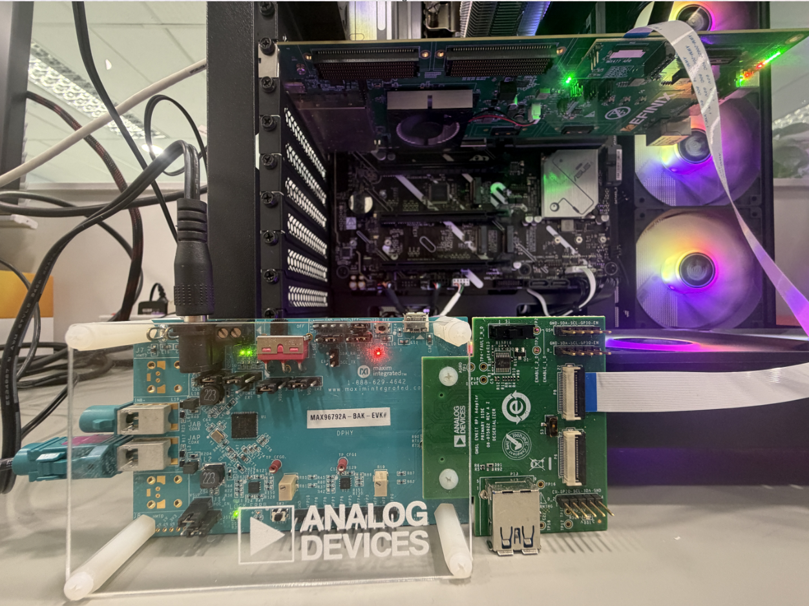
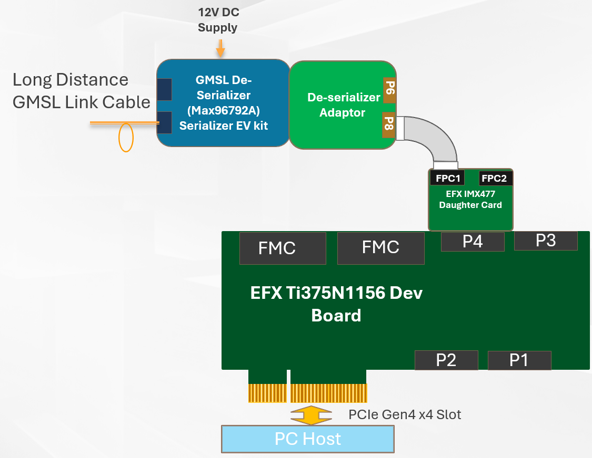
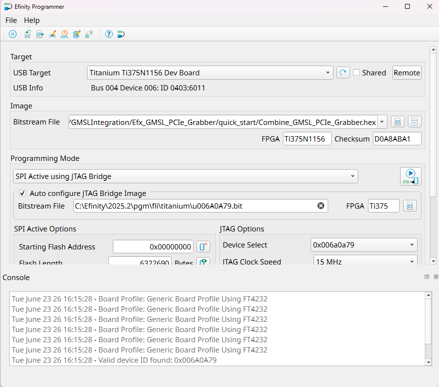

# Setup GMSL PCIe Grabber

This guide show on how to setup the development boards for HDMI Display. This setup only applicable for Titanium Ti180J484 development board. 

## Overall hardware required: 

PCIe Grabber related hardware are needed in the following:
- USB type-C cable 
- [Titanium Ti375n1156 Development Kit](https://www.efinixinc.com/docs/ti375n1156-devkit-ug-v1.6.pdf) 

## Steps for connecting the hardware to Ti375n1156 Development Board and ADI GMSL De-Serilaizer EVK 

1. Plug  Ti375N1156 Dev Board on PCIe slot of the PC host. 
2. Attach the chain of the ADI GMSL De-Serializer to QSE Connector P4. [Go to Setup Guide of GMSL Serializer to Efinix Dev Board](setup_gmsl_deserializer.md)
3. Ensure all boards have the followings jumper settings:

| **Board**                            | **Header**                  | **Pins to Connect**                               |
|--------------------------------------|-----------------------------|---------------------------------------------------|
| Titanium Ti180J484 Development Board | J7, J6, J18,                                                                     | 5 - 6 and 7 - 8                                    |

## Configuration of the Efinix Dev Boards 

1. Download the latest Efinity Software  and install to PC. 
2. Open Efinity and click start the programmer. 
3. Choose the USB Target (i.e., Titanium Ti180 J484 Development Board). 
4. Choose the SPI Active using JTAG Bridge (New) programming mode.
5. In the Image box, click the Select Image File button and find the precomplied bitstream Combine_GMSL_PCIe_Grabber.hex in [quick start folder](../quick_start/Combine_GMSL_PCIe_Grabber.hex).
6. Turn on the Auto configure JTAG Bridge Image option. 
7. Ensure that the Starting Flash Address is set to 0x000000. Click Start Program button. The Programmer will configure the FPGA to JTAG Bridge mode and then program the flash device