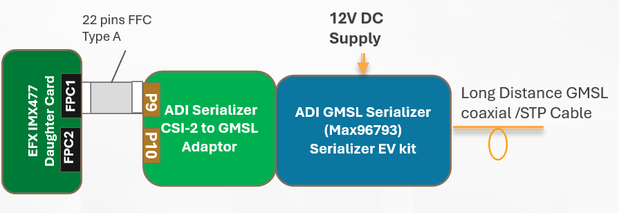
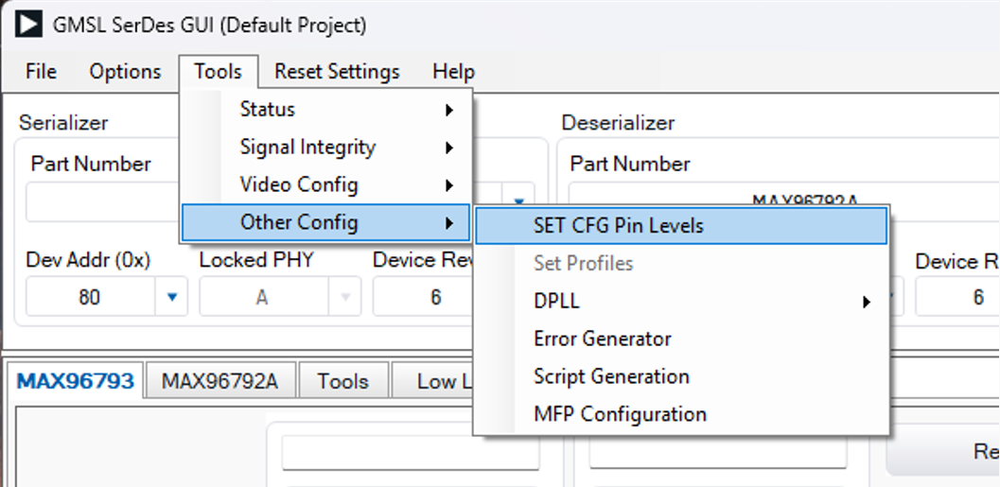
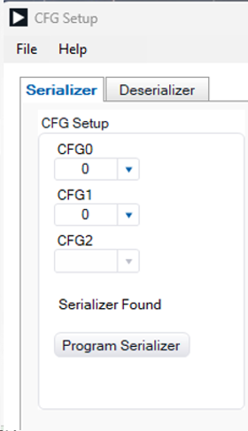

# Connection Chain of ADI GMSL Serializer to Efinix Dev Board 

1. On the Serializer Adaptor board , select the S2 to 1 to Enable Cam 1. 
2. Attach Serializer Adaptor to Serializer EVK.
3. Connecting the Connector P9 of Serializer Adatpor board to Connector FPC1 of Efinix IMX477 Daugther Card Through 22 Pins FFC cable (Type A, Same side). 

## Configuration of the ADI GMSL Serializer

1. Download and Install the ADI GMSL SerDes GUI.
2. Connect  the Serializer EVK to PC through USB. 
3. Power up the Serializer. 
4. Open the App to connecting the Serializer EVK for Configure the CFG0 and CFG1 of the EVK. 

5. Select Tools/SET CFG Pin levels

6. Program the corresponding Value of CFG0 and CFG1 to the Serializer

### Table 1: 
| | STP Cable | | Coaxial Cable | | Description |
| :--- | :---: | :---: | :---: | :---: | :--- |
| | **CFG0** | **CFG1** | **CFG0** | **CFG1** | |
| **Serializer (MAX96793)** | 0 | 0 | 0 | 4 | I2C, Device Address 0x50, 6GBps, NRZ, Tunnel Mode, ROR |
