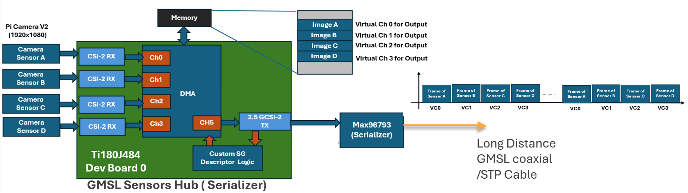
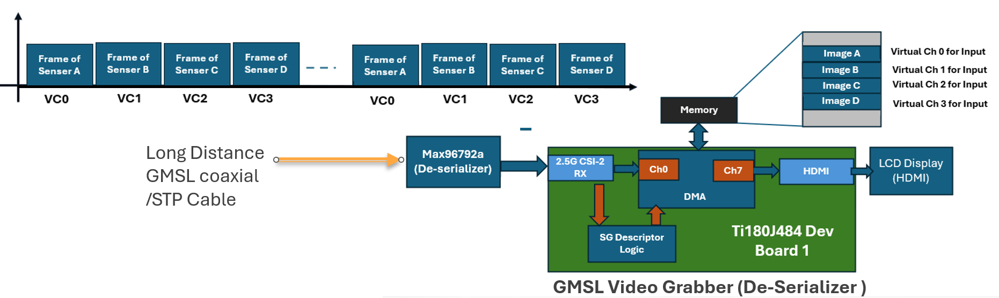
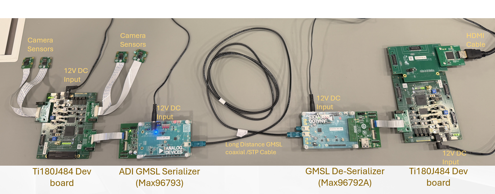
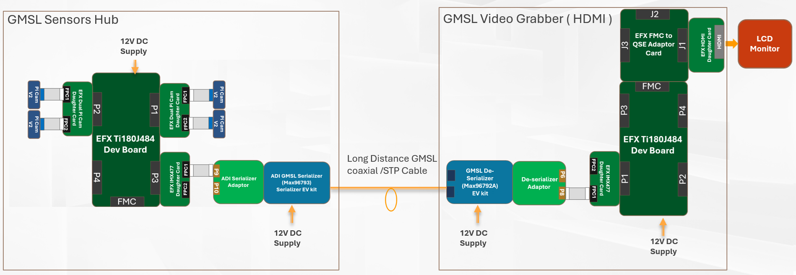
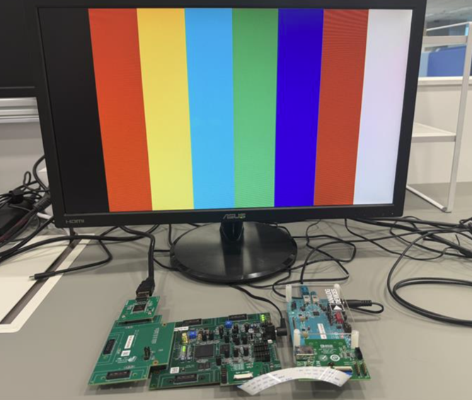
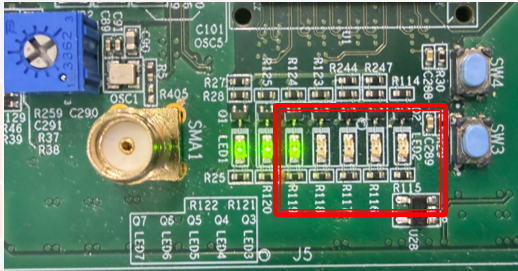
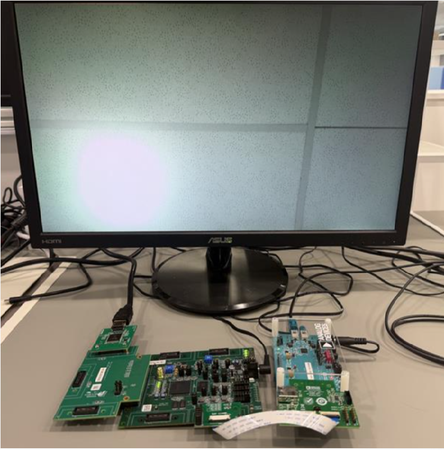

## 🎥 GMSL Multi Video Streaming Demonstration

## 📑 Table of Contents
- [Overview](#Overview)
- [Software Requirements](#Software-Requirements)
- [Getting Start](#Getting-Start)
    - [Demo for GMSI Sensors hub → HDMI Display](#demo-1)
    - [Demo for GMSI Sensors hub → PCIe Grabber](#demo-2)

- [Document](#document)

---

### Overview
This project demonstrates a **GMSL multi video streaming system** with two demo setups:
This project will demostrates Multi Video Steaming though single GMSL-link cable. 
- Reduces wiring complexity with Coaxial  or Twisted Pair Cable
- High Bandwidth
- Long-Distance Transmission (<15M)
- Standard Virtual Channel implementation on MIPI CSI-2

4 Camera Senosrs video source would be collected by Efinix Ti180J484 through MIPI CSI2(RX) ports. The frames of each camera sensor would be send out through MIPI CSI-2(TX) of a single GMSL serializer (MAX96793 )  
Video Frames of difference sensors would be send out by Time multiplex.  Video Frame of each sensors would be send out though assigned Virtual Channel of MIPI.

In the Receiver side, the video soruces would be capture by another FPGA form a single GMSL De-serializer. The incoming frames would be stored to difference memory space with corrsponidng virtual channel. 
This project included two demonstrates as video grabber: 
- [HDMI Display](#demo-1)
- [PCIe Grabber](#demo-2)

## Software-Requirements

### Efinity Software Version 

- [Efinity 2025.2.288.3.8](https://www.efinixinc.com/support/efinity.php) [v2025.2]

- Follow the official [documentation](https://www.efinixinc.com/support/docsdl.php?s=ef&pn=UG-EFN-SOFTWARE) on installation process.

### Efinity RISC-V Embedded Software IDE

- [v2025.2V](https://www.efinixinc.com/support/efinity.php) or above

- Follow the official [documentation](https://www.efinixinc.com/support/docsdl.php?s=ef&pn=SAPPHIREUG) on installation process 

- Learn more at the [official website](https://www.efinixinc.com/products-efinity-riscv-ide.html)

### GMSL SerDes Public GUI Software 1.6.1

- The Download link could be download in the tab "Tools & Simulations" of the Link
 - [Version 1.6.1](https://ez.analog.com/video/f/q-a/572075/cannot-download-gmsl-serdes-public-gui-software-1-4-2) or above

###  Getting-Start
   
## demo-1: 

## GMSL-HDMI-DISPLAY

In the HDMI Display part , Efinix Ti180J484 will capture the videos of difference Video Channel (virtual Channel) form a single GMSL De-serializer (MAX96792a). 
Each frames would be stored to difference memory space with corrsponidng virtual channel. The Each channel of Video source could be shown on monitor directly though HDMI port.   
User could select the target Video Channel or a signale view for combining all 4 Channel. The output resulation would be 1920x1080. 

 ## Demonstrate for GMSL Sensors Hub to HDMI Display

## System Configuation 
 1. Prepare setup of the GMSL Sensors Hub and HDMI Disply with GMSL EV Kit and Efinix Development Boards.  
    - [Go to Setup Guide of GMSL Sensors Hub](Efx_GMSL_SensorsHub/docs/setup_gmsl_sensorshub.md)
    - [Go to Setup Guide of GMSL HDMI Display](Efx_GMSL_HDMI_Display/docs/setup_HDMI_dispaly.md)
 2. Connecting the GMSL Sensors Hub to GMSL Video Grabber (HDMI) through GMSL Coaxial /STP Calbe.  
 3. Connecting the Porto f HDMI to LCD Monitor through HDMI cable

# Running
 1. Power UP Sequency:
    - Power up Serializer EVK 
    - Power up De-Serializer EVK 
    - Power up GMSL HDMI Display 
 2. Monitor would showing Colour Bar if no video streaming to the GMSL HDMI Display. 

  

 3. Power up the GMSL Sensors Hub.  

 4. LEDs of GMSL Sensors Hub and HDMI Display will indicate the status of the systemn as the following table

 

    | Component               | LED7  | LED6 blinking    | LED5 blinking    | LED4 blinking    | LED3 blinking    |
    |-------------------------|-------|------------------|------------------|------------------|------------------|
    | GMSL Sensors Hub        | Ready | RX from Sensor 3 | RX from Sensor 2 | RX from Sensor 1 | RX from Sensor 0 |
    | GMSL Video Grabber(HDMI)| Ready |                  |                  |                  | RX from GMSL Link|
    
 5. The received video will show on LCD display through the HDMI. 
 6. pressing SW4 once of TI180J484 Dev Board (HDMI Display) will change the view of input Video channels. The sequency will be:    
     Senser 1 → Sensor 2 → Sensor 3 → 4 Channels in 1 View →  Senser 0 → .....

      

## demo 2: 

## GMSL-PCIe-GRABBER
In the PCIe Grabber part , Efinix Ti375n1156 will capture the video soruce of difference virtual Channel form a single GMSL De-serializer (MAX96792a). 
Each frames would be stored to difference memory space with corrsponidng virtual channel. The PC-host will capture the video sources through the PCIe and show the video on Apps. 

## Domonstration for GMSL Sensors Hub to PCIe Grabber
   Building .......

### document 
- [ADI GMSL Serializer EVK](https://www.analog.com/media/en/technical-documentation/data-sheets/max96717ev.pdf)
- [ADI GMSL De-serializer EVK](https://www.analog.com/media/en/technical-documentation/data-sheets/max96716evkit.pdf)
- [ADI GMSL EVK Adapter Board](https://analogdevicesinc.github.io/documentation/solutions/reference-designs/ad-gmslcamrpi-adp/index.html)
- [Titanium Ti180J484 Development Kit](https://www.efinixinc.com/docs/ti180j484-devkit-ug-v1.7.pdf)
- [Titanium Ti375N1156 Development Kit](https://www.efinixinc.com/docs/ti375n1156-devkit-ug-v1.6.pdf)
- [Raspberry Pi Camera V2](https://www.raspberrypi.com/products/camera-module-v2/)

