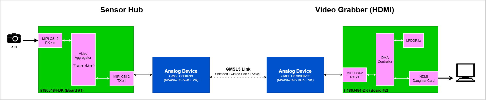
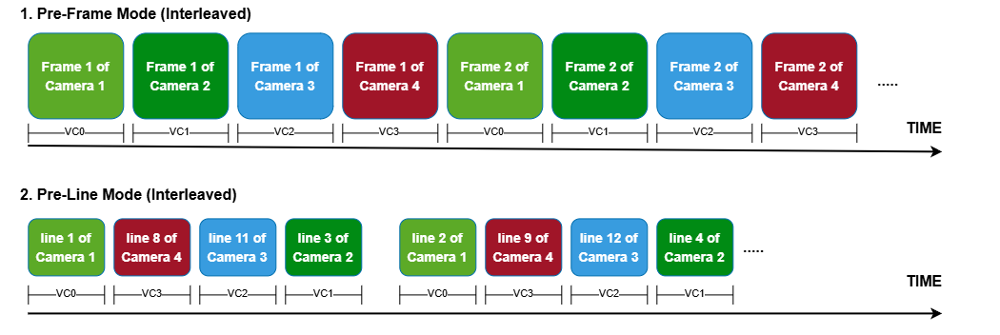

# GMSL Integration

This project demonstrates multi-camera streaming into a central hub, which consolidates the feeds over a single GMSL interface. The live video is transmitted to a secondary terminal, enabling simultaneous multi-video grid view display via HDMI.

# Table of Contents
* [Overview](#overview)
* [Demo Selection](#demo-selection)
  * [Per-Frame Mode 4x1080p](efx-gmsl-video-frame-4x1080p/)
  * [Per-Line Mode 4×1080p](efx-gmsl-video-line-4x1080p/)
  * [Per-Line Mode 2×4K](efx-gmsl-video-line-2x4K/)
* [Performance](#performance)
* [Resource Utilization](#resource-utilization)
* [Hardware Requirement](#hardware-requirement)
* [Software Requirement](#software-requirement)
  * [Efinity Software](#efinity-software)
   * [Efinity RISC-V Embedded Software IDE](#efinity-risc-v-embedded-software-ide)
  * [GMSL SerDes Public GUI Software](#gmsl-serdes-public-gui-software)
* [Project Directory Description](#project-directory-description)
* [Useful Links](#useful-links)


# Overview



The demonstration is divided into two parts: **Sensor Hub** and **Video Grabber**. 

- **Sensor Hub**  
  Aggregates video frames from four-camera inputs and packs them into a single MIPI CSI‑2 TX channel using virtual channels (VC).  
  The pixel data is then passed to the Analog Devices Inc. MAX96793 for GMSL serialization and transmission.

- **Video Grabber**  
  Deserializes data from the GMSL link with the Analog Devices Inc. MAX96792A and converts it to MIPI CSI‑2 packeted data for the Titanium&#8482; Ti180 FPGA.  
   The FPGA extracts the video frames from the virtual channels and outputs them to the HDMI display monitor.

The project demonstrates two distinct video aggregation architectures—**Per-Frame Mode** and **Per-Line Mode**.


- **Per-Frame Mode**
The video aggregation is implemented in a per-frame architecture. Frames from each individual video channel are buffered in system memory and transmitted sequentially to a GMSL serializer. 
- **Per-Line Mode**
The video aggregation is implemented in a line-interleave architecture. Instead of buffering full frames, lines of video data from each individual channel are multiplexed in real time and transmitted sequentially to a GMSL serializer.




| Operating Mode | Memory Location & Storage | Aggregation Strategy | Priority Scheduling | Latency Profile |
| :--- | :--- | :--- | :--- | :--- |
| **Per-Frame** | External Memory (Off-chip LPDDR4 Frame Buffer) | **Macroscopic:** Collects and buffers a complete frame block before processing. | Strict Round-Robin | High Delay |
| **Per-Line** | Internal FPGA RAM (On-chip BRAM Line FIFOs) | **Microscopic:** Packs fine-grained line chunks for immediate real-time streaming. | Highest-Occupancy-First (HOF) <br>*(Based on arrived lines)* | Low Delay |


# Demo Selection

Choose one of the three available demonstrations based on your camera count and resolution needs:

| Demo | Mode | Camera input| Resolution | GMSL Link Setup |
|------|------|---------|------------|--------|
| [Per-Frame Mode 4x1080p](efx-gmsl-video-frame-4x1080p/) | Per-Frame | 4 x IMX219 | 1080p | 6 Gbps, MIPI CSI-2, 2 lanes |
| [Per-Line Mode 4x1080p](efx-gmsl-video-line-4x1080p/) | Per-Line | 4 x IMX219 | 1080p | 12 Gbps, MIPI CSI-2, 4 lanes |
| [Per-Line Mode 2x4K](efx-gmsl-video-line-2x4K/) | Per-Line | 2 x IMX477 | 4K | 12 Gbps, MIPI CSI-2, 4 lanes |


# Performance
| Demo | Num of Channel |  Resolution | Channel Frame Rate | Link Throughput |
|------|----------------|-------------|--------------------|-----------------|
| [Per-Frame Mode 4x1080p](efx-gmsl-video-frame-4x1080p/) | 4 | 1920x1080 @RAW10 | 22 FPS | 1.8 Gbps |
| [Per-Line Mode 4x1080p](efx-gmsl-video-line-4x1080p/) | 4 | 1920x1080 @RAW10 | 72 FPS | 6.1 Gbps |
| [Per-Line Mode 2x4K](efx-gmsl-video-line-2x4K/) | 2 | 3840x2160 @RAW10 | 44 FPS | 7.6 Gbps |


# Resource Utilization
| Demo | Projects | Device | XRL | Memory Block | DSP Block |
| :--- | :--- | :--- | :---: | :---: | :---: |
| [Per-Frame Mode 4x1080p](efx-gmsl-video-frame-4x1080p/) | efx-gmsl-sensorhub-4cam | Ti180J484 | 64855 / 172800 | 420 / 1280 | 4 / 640 |
| | efx-gmsl-video-grabber-hdmi | Ti180J484 | 66093 / 172800 | 426 / 1280 | 4 / 640 |
| [Per-Line Mode 4x1080p](efx-gmsl-video-line-4x1080p/) | efx-gmsl-sensorhub-line-4cam | Ti180J484 | 34529 / 172800 | 496 / 1280 | 12 / 640 |
| | efx-gmsl-video-grabber-line-hdmi | Ti180J484 | 59101 / 172800 | 514 / 1280 | 4 / 640 |
| [Per-Line Mode 2x4K](efx-gmsl-video-line-2x4K/) | efx-gmsl-sensorhub-line-4cam | Ti180J484 | 34604 / 172800 | 640 / 1280 | 12 / 640 |
| | efx-gmsl-video-grabber-line-hdmi | Ti180J484 | 59101 / 172800 | 514 / 1280 | 4 / 640 |


# Hardware Requirement
### GMSL Sensor Hub (4 IMX219 Cameras)
Note: For the demo with 4 Raspberry Pi Camera V2 connected to the Sensor Hub 
- [Titanium&#8482; Ti180J484-DK](https://www.efinixinc.com/products-devkits-titaniumti180j484.html)
  - Titanium&#8482; Ti180J484 Development Board
  - 2 x [Dual Raspberry Pi Camera Connector Daughter Card](https://www.efinixinc.com/support/docsdl.php?s=ef&pn=DUAL-RPICAM-DC-UG)
  - 4 x [Raspberry Pi Camera Module 2](https://www.raspberrypi.com/products/camera-module-v2/)   *(each development kit contains 2 cameras)*
  - IMX477 Camera Connector Daughter Card
- [ADI MAX96793 DPHY Evaluation Kit (GMSL2/3 Serializer, CSI-2, P/N: MAX96793-ACK-EVK#)](https://www.analog.com/en/resources/evaluation-hardware-and-software/evaluation-boards-kits/max96717f-aak-evk.html)
- [ADI GMSL Evaluation Kit Adapter Board](https://www.analog.com/en/resources/evaluation-hardware-and-software/evaluation-boards-kits/ad-gmslcamrpi-adp.html)
- 22-pin FFC Cable (Type A) - *The FFC cable that comes with the GMSL Evaluation Kit Adapter Board (Type B) does not fit*

### GMSL Sensor Hub (2 IMX477 Cameras)
Note: For the demo with 2 IMX477 cameras connected to the Sensor Hub
- [Titanium&#8482; Ti180J484-DK](https://www.efinixinc.com/products-devkits-titaniumti180j484.html)
  - Titanium&#8482; Ti180J484 Development Board
  - 2 x [IMX477 Camera Module](https://www.arducam.com/b0242-arducam-imx477-hq-camera.html)
  - 2 x IMX477 Camera Connector Daughter Card
- [ADI MAX96793 DPHY Evaluation Kit (GMSL2/3 Serializer, CSI-2, P/N: MAX96793-ACK-EVK#)](https://www.analog.com/en/resources/evaluation-hardware-and-software/evaluation-boards-kits/max96717f-aak-evk.html)
- [ADI GMSL Evaluation Kit Adapter Board](https://www.analog.com/en/resources/evaluation-hardware-and-software/evaluation-boards-kits/ad-gmslcamrpi-adp.html)
- 22-pin FFC Cable (Type A) - *The FFC cable that comes with the GMSL Evaluation Kit Adapter Board (Type B) does not fit*


### GMSL Video Grabber (HDMI)
- [Titanium&#8482; Ti180J484-DK](https://www.efinixinc.com/products-devkits-titaniumti180j484.html)
  - Titanium&#8482; Ti180J484 Development Board
  - IMX477 Camera Connector Daughter Card
  - [FMC-to-QSE Adapter Card (Rev. C)](https://www.efinixinc.com/support/docsdl.php?s=ef&pn=FMC-QSE-DC-UG)
  - [HDMI Connector Daughter Card](https://www.efinixinc.com/support/docsdl.php?s=ef&pn=HDMI-DC-UG)
- [ADI MAX96792A DPHY Evaluation Kit (GMSL2/3 De-serializer, CSI-2, P/N: MAX96792A-BCK-EVK#)](https://www.analog.com/en/resources/evaluation-hardware-and-software/evaluation-boards-kits/max96716evkit.html)
- 22-pin FFC Cable (Type A) - *The FFC cable that comes with the GMSL Evaluation Kit Adapter Board (Type B) does not fit*

# Software Requirement
### Efinity Software
- [v2025.2.288](https://www.efinixinc.com/support/efinity.php) 
- Follow the official [documentation](https://www.efinixinc.com/support/docsdl.php?s=ef&pn=UG-EFN-SOFTWARE) on installation process.
### Efinity RISC-V Embedded Software IDE
- [v2025.2](https://www.efinixinc.com/support/efinity.php)
- Follow the official [documentation](https://www.efinixinc.com/support/docsdl.php?s=ef&pn=SAPPHIREUG) on installation process 
- Learn more at the [official website](https://www.efinixinc.com/products-efinity-riscv-ide.html)
### GMSL SerDes Public GUI Software
- [Version 1.6.1](https://www.analog.com/en/resources/evaluation-hardware-and-software/software/software-download?swpart=SFW0019760J) or above

# Project Directory Description
```
.
└── gmsl-integration/
    ├── efx-gmsl-video-frame-4x1080p/                                        # GMSL Video Streaming Demo (Per-Frame mode, 4cam @ 1080p)
    │    ├── efx-gmsl-sensorhub-4cam/                                          
    │    │   └── ti180j484-dk/                                                 
    │    │       └── embedded_sw/                                            # RISC-V embedded software workspace of Sensor Hub
    │    │       └── efx-gmsl-sensorhub-4cam.xml                             # Efinity project of Sensor Hub
    │    └── efx-gmsl-video-grabber-hdmi/                                      
    │        └── ti180j484-dk/                                                 
    │            └── embedded_sw/                                            # RISC-V embedded software workspace of Video Grabber
    │            └── efx-gmsl-video-grabber-hdmi.xml                         # Efinity project of Video Grabber
    │          
    ├── efx-gmsl-video-line-4x1080p/                                         # GMSL Video Streaming Demo (Per-Line mode, 4cam @ 1080p)
    │    ├── efx-gmsl-sensorhub-4cam/                                             
    │    │   └── ti180j484-dk/                                                    
    │    │       └── embedded_sw/                                            # RISC-V embedded software workspace of Sensor Hub
    │    │       └── efx-gmsl-sensorhub-line-4cam.xml                        # Efinity project of Sensor Hub
    │    └── efx-gmsl-video-grabber-hdmi/                                         
    │        └── ti180j484-dk/                                                    
    │            └── embedded_sw/                                            # RISC-V embedded software workspace of Video Grabber
    │            └── efx-gmsl-video-grabber-line-hdmi.xml                    # Efinity project of Video Grabber
    │            
    ├── efx-gmsl-video-line-2x4K/                                            # GMSL Video Streaming Demo (Per-Line mode, 2cam @ 4K)
    │    ├── efx-gmsl-sensorhub-4cam/                                            
    │    │   └── ti180j484-dk/                                                   
    │    │       └── embedded_sw/                                            # RISC-V embedded software workspace of Sensor Hub
    │    │       └── efx-gmsl-sensorhub-line-4cam.xml                        # Efinity project of Sensor Hub
    │    └── efx-gmsl-video-grabber-hdmi/                                         
    │        └── ti180j484-dk/             
    │            └── embedded_sw/                                            # RISC-V embedded software workspace of Video Grabber
    │            └── efx-gmsl-video-grabber-line-hdmi.xml                    # Efinity project of Video Grabber
    │ 
    ├── LICENSE
    ├── VERSION
    ├── README.md
    │
    └── prebuild/                                                             # Find the prebuild folder in Release Build
        ├── efx-gmsl-video-frame-4x1080p/                                     # GMSL Video aggregator (Per-Frame mode, 4cam @ 1080p)
        │    ├── bootloader/                                                  # Bootloader for both firmware images
        │    ├── fpga/                                                        # Bitstream for Efinity project
        │    ├── fw/                                                          # Compiled firmware image
        │    └── quickstart/                                                  # Combined bitstream (fpga+fw) for quick demo deployment
        │        ├── efx-gmsl-sensorhub-4cam_combined.hex                     
        │        └── efx-gmsl-video-grabber-hdmi_combined.hex       
        ├── efx-gmsl-video-line-4x1080p/                                      # GMSL Video aggregator (Per-Line mode, 4cam @ 1080p)
        │    ├── bootloader/                                                  # Bootloader for both firmware images
        │    ├── fpga/                                                        # Bitstream for Efinity project
        │    ├── fw/                                                          # Compiled firmware image
        │    └── quickstart/                                                  # Combined bitstream (fpga+fw) for quick demo deployment
        │        ├── efx-gmsl-sensorhub-line-4x1080p_combined.hex 
        │        └── efx-gmsl-video-grabber-line-hdmi-4x1080p_combined.hex  
        └── efx-gmsl-video-line-2x4K/                                         # GMSL Video aggregator (Per-Line mode, 2cam @ 4K) 
             ├── bootloader/                                                  # Bootloader for both firmware images
             ├── fpga/                                                        # Bitstream for Efinity project
             ├── fw/                                                          # Compiled firmware image
             └── quickstart/                                                  # Combined bitstream (fpga+fw) for quick demo deployment
                 ├── efx-gmsl-sensorhub-line-2x4K_combined.hex
                 └── efx-gmsl-video-grabber-line-hdmi-2x4K_combined.hex

```
**Note:** The file `bootloader.hex` located in `prebuild/bootloader/` is required when updating or regenerating the SoC IP. 
To access this file:
- Navigate to the repository **Release** tag.
- Download `prebuild_vx.x.x.zip`.
- Extract the ZIP file to the parent directory.
- Ensure the archive is extracted **prior to** opening the IP configuration or starting the generation process.


# Useful Links
- [Titanium&#8482; Ti180 J484 Development Kit User Guide](https://www.efinixinc.com/support/docsdl.php?s=ef&pn=Ti180J484-DK-UG)  
- [Efinity&#174; Software User Guide](https://www.efinixinc.com/support/docsdl.php?s=ef&pn=UG-EFN-SOFTWARE)  
- [Sapphire RV32 SoC User Guide](https://www.efinixinc.com/support/docsdl.php?s=ef&pn=SAPPHIREUG)  
- [AD-GMSLCAMRPI-ADP# Schematics](https://wiki.analog.com/_media/resources/eval/user-guides/02_075922a_top.pdf)  


### Serializer (MAX96793)  
- [MAX96717/MAX96793 DPHY Evaluation Kit Data Sheet](https://www.analog.com/media/en/technical-documentation/data-sheets/max96717ev.pdf)  
- [MAX96793: CSI-2 to GMSL3/2 Serializer Data Sheet](https://www.analog.com/media/en/technical-documentation/data-sheets/max96793.pdf)  
- [MAX96793 Device Specific User Guide](https://www.analog.com/media/en/technical-documentation/user-guides/max96793-device-specific-user-guide.pdf)  

### Deserializer (MAX96792A)  
- [MAX96716A/MAX96716F/MAX96792A DPHY Evaluation Kit Data Sheet](https://www.analog.com/media/en/technical-documentation/data-sheets/max96716evkit.pdf)  
- [MAX96792A: Dual GMSL3/2 to CSI-2 Deserializer Data Sheet](https://www.analog.com/media/en/technical-documentation/data-sheets/max96792a.pdf)  
- [MAX96792A Dual GMSL3 to CSI-2 Deserializer User Guide](https://www.analog.com/media/en/technical-documentation/user-guides/max96792a-device-specific-user-guide.pdf)  
