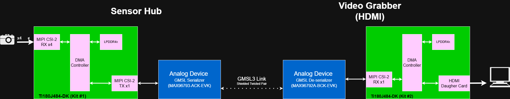
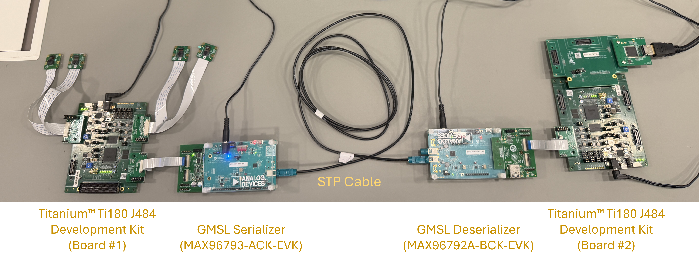
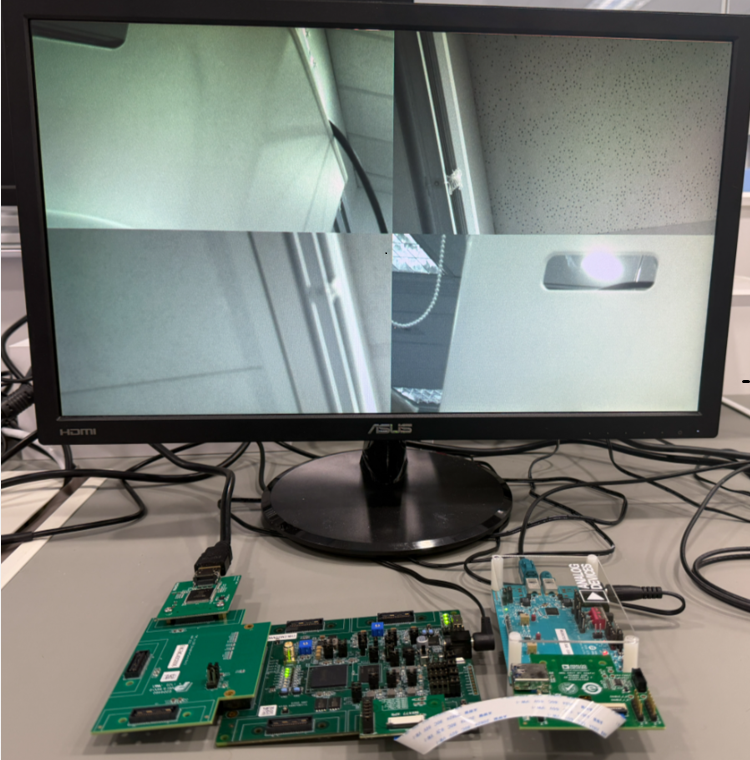

# GMSL Integration
This project highlights the integration of four cameras, streaming through a GMSL link, with output displayed on HDMI ports.

# Table of Contents
* [Overview](#overview)
* [Hardware Requirement](#hardware-requirement)
  * [GMSL Sensor Hub (4 Cameras)](#gmsl-sensor-hub-4-cameras)
  * [GMSL Video Grabber (HDMI)](#gmsl-video-grabber-hdmi)
* [Software Requirement](#software-requirement)
  * [Efinity Software](#efinity-software)
  * [Eifnity RISC-V Embedded Software IDE](#efinity-risc-v-embedded-software-ide)
  * [GMSL SerDes Public GUI Software](#gmsl-serdes-public-gui-software)
* [Getting Start](#getting-start)
  * [Configurating GMSL Sensor Hub](#configurating-gmsl-sensor-hub)
  * [Configurating GMSL Video Grabber (HDMI)](#configurating-gmsl-video-grabber-hdmi)
  * [Running Video Streaming Demo](#running-video-streaming-demo)
* [Result](#result)
  * [Sensor Hub User IO Behavior (Board #1)](#sensor-hub-user-io-behavior-board-1)
  * [Video Grabber User IO Behavior (Board #2)](#video-grabber-user-io-behavior-board-2)
  * [Video Display Output](#video-display-output)
* [Resource Utilization](#resource-utilization)
* [Performance](#performance)
* [Project Directory Description](#project-directory-description)
* [Useful Links](#useful-links)

# Overview
The demonstration is divided into two parts: **Sensor Hub** and **Video Grabber**.

- **Sensor Hub**  
  Aggregates video frames from four-camera inputs and packs them into a single MIPI CSI‑2 TX channel using virtual channels (VC).  
  The pixel data is then passed to the Analog Devices Inc. MAX96793 for GMSL serialization and transmission.

- **Video Grabber**  
  Deserializes the data from GMSL link with the Analog Device Inc. MAX96792A and convert to MIPI CSI‑2 packeted data to the Titanium&#8482; Ti180 FPGA.  
  The FPGA extracts the video frames from the virtual channels and output to HDMI display monitor.



# Hardware Requirement
### GMSL Sensor Hub (4 Cameras)

- [Titanium&#8482; Ti180J484-DK](https://www.efinixinc.com/products-devkits-titaniumti180j484.html)
  - Titanium&#8482; Ti180J484 Development Board
  - 2 x [Dual Raspberry Pi Camera Connector Daughter Card](https://www.efinixinc.com/support/docsdl.php?s=ef&pn=DUAL-RPICAM-DC-UG)
  - 4 x [Raspberry Pi Camera Module 2](https://www.raspberrypi.com/products/camera-module-v2/)   *(each development kit contain 2 cameras)*
  - IMX477 Camera Connector Daughter Card
- [ADI MAX96793 DPHY Evaluation Kit (GMSL2/3 Serializer, CSI-2, P/N: MAX96793-ACK-EVK#)](https://www.analog.com/en/resources/evaluation-hardware-and-software/evaluation-boards-kits/max96717f-aak-evk.html)
- [ADI GMSL Evaluation Kit Adapter Board](https://www.analog.com/en/resources/evaluation-hardware-and-software/evaluation-boards-kits/ad-gmslcamrpi-adp.html)
- 22-pin FFC Cable (Type A) - *The FFC cable come with GMSL Evalution Kit Adapter Board (Type B) does not fit*
### GMSL Video Grabber (HDMI)
- [Titanium&#8482; Ti180J484-DK](https://www.efinixinc.com/products-devkits-titaniumti180j484.html)
  - Titanium&#8482; Ti180J484 Development Board
  - IMX477 Camera Connector Daughter Card
  - [FMC-to-QSE Adapter Card (Rev. C)](https://www.efinixinc.com/support/docsdl.php?s=ef&pn=FMC-QSE-DC-UG)
  - [HDMI Connector Daughter Card](https://www.efinixinc.com/support/docsdl.php?s=ef&pn=HDMI-DC-UG)
- [ADI MAX96792A DPHY Evaluation Kit (GMSL2/3 De-serializer, CSI-2, P/N: MAX96792A-BCK-EVK#)](https://www.analog.com/en/resources/evaluation-hardware-and-software/evaluation-boards-kits/max96716evkit.html)
- 22-pin FFC Cable (Type A) - *The FFC cable come with GMSL Evalution Kit Adapter Board (Type B) does not fit*

# Software Requirement
### Efinity Software
- [v2025.2.288](https://www.efinixinc.com/support/efinity.php) 
- Follow the official [documentation](https://www.efinixinc.com/support/docsdl.php?s=ef&pn=UG-EFN-SOFTWARE) on installation process.
### Efinity RISC-V Embedded Software IDE
- [v2025.2](https://www.efinixinc.com/support/efinity.php)
- Follow the official [documentation](https://www.efinixinc.com/support/docsdl.php?s=ef&pn=SAPPHIREUG) on installation process 
- Learn more at the [official website](https://www.efinixinc.com/products-efinity-riscv-ide.html)
### GMSL SerDes Public GUI Software
- [Version 1.6.1](https://www.analog.com/en/resources/evaluation-hardware-and-software/software/software-download?swpart=SFW0019760J) or above

# Getting Start
### Configurating GMSL Sensor Hub 
* [Setup Guide: GMSL Sensor Hub - Ti180J484-DK (Board #1)](efx-gmsl-sensorhub-4cam/ti180j484-dk/docs/setup_sensor-hub-4cam_ti180j484-dk.md)
* [Setup Guide: GMSL Sensor Hub - ADI GMSL Serializer (MAX96793-ACK-EVK#)](efx-gmsl-sensorhub-4cam/ti180j484-dk/docs/setup_gmsl-serializer_max96793-ack-evk.md)
### Configurating GMSL Video Grabber (HDMI)
* [Setup Guide: Video Grabber (HDMI) - Ti180J484-DK (Board #2)](efx-gmsl-video-grabber-hdmi/ti180j484-dk/docs/setup_video-grabber-hdmi_ti180j484-dk.md)
* [Setup Guide: Video Grabber (HDMI) - ADI GMSL Deserializer (MAX96792A-BCK-EVK#)](efx-gmsl-sensorhub-4cam/ti180j484-dk/docs/setup_gmsl-deserializer_max96792a-bck-evk.md)
### Running Video Streaming Demo
Once all the kits are configurated properly, follow the steps below to start the video streaming demonstration:
1. Connecting the Sensor Hub Deserializer and Video Grabber Serializer using STP cable, and connect a monitor with HDMI cable.  


2. Turn on the power in this sequence: 
    - ADI Serializer EVK
    - ADI Deserializer EVK
    - Titanium&#8482; Ti180J180-DK (Sensor Hub, Board #2)
    - Once color bar is shown on monitor, turn on Titanium&#8482; Ti180J480-DK (Video Grabber, Board #1)  
      

# Result

### Sensor Hub User IO Behavior (Board #1)
* SW4: System reset
* LED7: Initialization done
* LED3-6: Camera 0-3 streaming video

### Video Grabber User IO Behavior (Board #2)
* SW4: Video mode switching: CAM0 -> CAM1 -> CAM2 -> CAM3 -> Split-screen (multi-view) -> CAM0 -> ...
* LED7: Initialization done
* LED3: Receiving data from GMSL link

### Video Display Output


# Resource Utilization
| Project               | Device     | XLR             | Memory Block  | DSP Block  |
|-----------------------|------------|-----------------|---------------|------------|
| Sensor Hub            | Ti180J484  | 64855 / 172800  | 420 / 1280    | 4 / 640    |
| Video Grabber (HDMI)  | Ti180J484  | 66093 / 172800  | 426 / 1280    | 4 / 640    |

# Performance
| Device               | i_pixel_clk (MHz)  | i_pixel_clk_tx (MHz)  | i_axi0_mem_clk (MHz) | i_axi1_mem_clk (MHz)  | i_hdmi_clk (MHz)  | i_soc_clk (MHz)  |
|----------------------|--------------------|-----------------------|----------------------|-----------------------|-------------------|------------------|
| Sensor Hub           | 221                | 226                   | 138                  | 192                   | N/A               | 154              |
| Video Grabber (HDMI) | 231                | N/A                   | 143                  | 183                   | 191               | 161              |

# Project Directory Description
```
.
└── gmsl_integration/
    ├── docs/
    │   ├── images
    │   └── .md
    ├── efx-gmsl-sensorhub-4cam/                                 # GMSL Sensor Hub (4-cam) project folder
    │   └── ti180j484-dk/                                        # Efinity project
    │       └── docs/ 
    │       └── embeddeded_sw/                                   # RISC-V embedded software project directory
    │       └── ...
    ├── efx-gmsl-video-grabber-hdmi/                             # GMSL Video Grabber (HDMI) project folder
    │   └── ... 
    ├── prebuild/                                                # Find the prebuild folder in Release Build
    │   ├── bootloader/                                          # Bootloader for both firmware images
    │   │   ├── bootloader.hex 
    │   ├── fpga/                                                # Bitstream for Efinity project
    │   │   ├── efx-gmsl-sensorhub-4cam.bit
    │   │   ├── efx-gmsl-sensorhub-4cam.hex
    │   │   ├── efx-gmsl-video-grabber-hdmi.bit
    │   │   └── efx-gmsl-video-grabber-hdmi.hex
    │   ├── fw/                                                  # Compiled firmware image
    │   │   ├── efx-gmsl-sensorhub-4cam.bin
    │   │   ├── efx-gmsl-sensorhub-4cam.elf
    │   │   ├── efx-gmsl-video-grabber-hdmi.bin
    │   │   └── efx-gmsl-video-grabber-hdmi.elf
    │   └── quick_start/                                         # Combined bitstream (fpga+fw) for quick demo deployment
    │       ├── efx-gmsl-sensorhub-4cam_combined.hex
    │       ├── efx-gmsl-sensorhub-4cam_combined.rpt             # Report from combining bitstream 
    │       ├── efx-gmsl-video-grabber-hdmi_combined.hex
    │       └── efx-gmsl-video-grabber-hdmi_combined.rpt
    ├── LICENSE
    ├── VERSION
    └── README.md
```

# Useful Links
[Titanium&#8482; Ti180 J484 Development Kit User Guide](https://www.efinixinc.com/support/docsdl.php?s=ef&pn=Ti180J484-DK-UG)  
[Efinity&#174; Software User Guide](https://www.efinixinc.com/support/docsdl.php?s=ef&pn=UG-EFN-SOFTWARE)  
[Sapphire RV32 SoC User Guide](https://www.efinixinc.com/support/docsdl.php?s=ef&pn=SAPPHIREUG)  
[AD-GMSLCAMRPI-ADP# Schematics](https://wiki.analog.com/_media/resources/eval/user-guides/02_075922a_top.pdf)  

Serializer (MAX96793)  
- [MAX96717/MAX96793 DPHY Evaluation Kit Data Sheet](https://www.analog.com/media/en/technical-documentation/data-sheets/max96717ev.pdf)  
- [MAX96793: CSI-2 to GMSL3/2 Serializer Data Sheet](https://www.analog.com/media/en/technical-documentation/data-sheets/max96793.pdf)  
- [MAX96793 Device Specific User Guide](https://www.analog.com/media/en/technical-documentation/user-guides/max96793-device-specific-user-guide.pdf)  

Deserializer (MAX96792A)  
- [MAX96716A/MAX96716F/MAX96792A DPHY Evaluation Kit Data Sheet](https://www.analog.com/media/en/technical-documentation/data-sheets/max96716evkit.pdf)  
- [MAX96792A: Dual GMSL3/2 to CSI-2 Deserializer Data Sheet ](hhttps://www.analog.com/media/en/technical-documentation/data-sheets/max96792a.pdf)  
- [MAX96792A Dual GMSL3 to CSI-2 Deserializer User Guide](https://www.analog.com/media/en/technical-documentation/user-guides/max96792a-device-specific-user-guide.pdf)  
