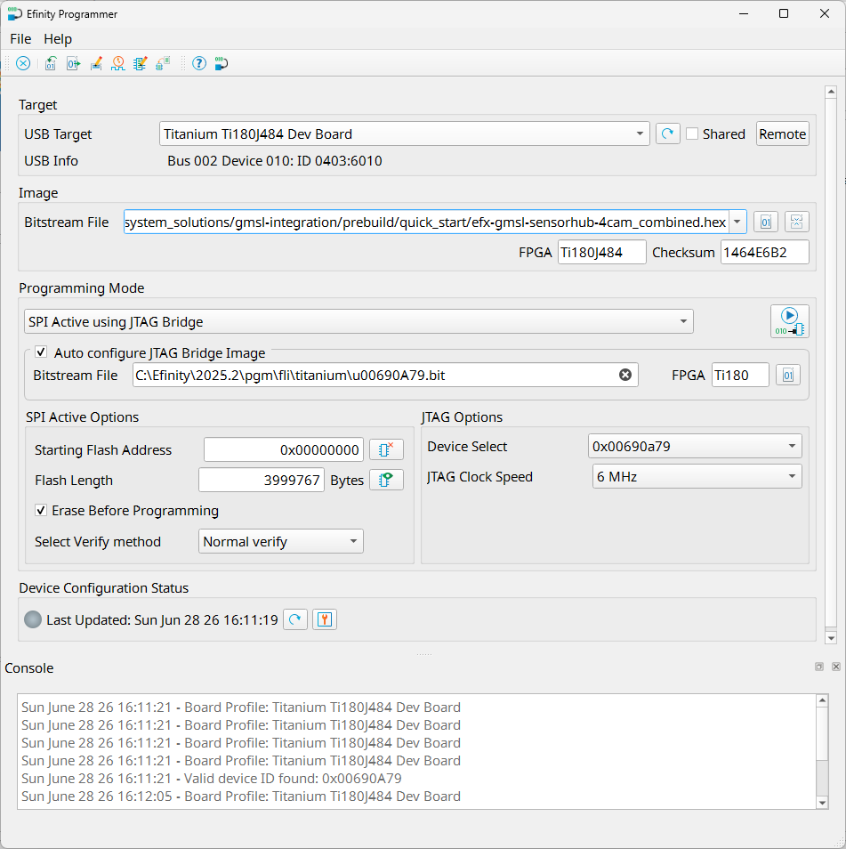

# Setup Guide: GMSL Sensor Hub - Ti180J484-DK (Board #1)

This document explains how to set up the Titanium Ti180J484 Development Board with the Sensor Hub. 

## Required Hardware
- [Titanium&#8482; Ti180J484-DK](https://www.efinixinc.com/products-devkits-titaniumti180j484.html)
  - Titanium&#8482; Ti180J484 Development Board
  - 2 x [Dual Raspberry Pi Camera Connector Daughter Card](https://www.efinixinc.com/support/docsdl.php?s=ef&pn=DUAL-RPICAM-DC-UG)
  - 4 x [Raspberry Pi Camera Module 2](https://www.raspberrypi.com/products/camera-module-v2/)   *(each development kit contain 2 cameras)*
  - IMX477 Camera Connector Daughter Card (22-pin)
- [ADI MAX96793 DPHY Evaluation Kit (GMSL2/3 Serializer, CSI-2, P/N: MAX96793-ACK-EVK#)](https://www.analog.com/en/resources/evaluation-hardware-and-software/evaluation-boards-kits/max96717f-aak-evk.html)
  - HMTD Cable
- [ADI GMSL Evaluation Kit Adapter Board](https://www.analog.com/en/resources/evaluation-hardware-and-software/evaluation-boards-kits/ad-gmslcamrpi-adp.html)
- 22-pin FFC Cable (Type A) - *The FFC cable come with GMSL Evalution Kit Adapter Board (which is Type B) does not fit*

## Stey-by-step Instruction

1. **Prepare the daughter cards**  
   - Connect the two Raspberry Pi camera modules to both top connector (FPC2) and bottom connector (FPC1) of Dual RPI Camera Connector Board using a 15‑pin FFC.
   - Duplicate to obtain 2 sets of Dual RPI Camera Connector Boards, connecting a total of 4 camera modules. *(each development kit contain 2 cameras)*

2. **Insert the daughter cards onto the Ti180J484 Development Board**  
   - Attach the daughter cards onto to QSE connectors **P1** and **P2** on the Ti180J484 development board.  

3. **Connect the ADI GMSL Serializer EVK**  
   - Use 22-pin FFC Cable (Type A) to connect IMX477 Camera Connector Daughter Card (**FPC1**, bottom connecter) with the ADI GMSL Serializer EVK (Adapter: **P9**) and insert it on to Ti180J484 Development Board **P3**.  
   - See [Setup Guide: GMSL Sensor Hub - ADI GMSL Serializer (MAX96793-ACK-EVK#)](setup_gmsl-serializer_max96793-ack-evk.md).  

4. **Configure jumper settings**  
   ### Ti180J484 Development Board
   | **Header**                      | **Jumper Conneciton**   |
   |---------------------------------|-------------------------|
   | J9, PT10                        | NC                      |
   | J10, J11, J12, J13, PT1, PT17   | 1‑2 and 3‑4             |
   | PT2–PT16                        | 1‑2                     |  

   ### Dual Raspberry Pi Camera Connector Daughter Card
   | **Header**   | **Jumper Conneciton**                 |
   |--------------|---------------------------------------|
   | J1           | 1-2 , 3-4 , 5-6 , 7-8 , 9-10 , 11-12  |  

   The final hardware setup as shown below:  
     

5. **FPGA Configuration**  
   To configure the FPGA logic design:
   - Connect the Ti180J484-DK with PC using USB Type-C cable and power on.
   - Open Efinity Programmer and select the USB Target (i.e. Titanium Ti180 J484 Development Board)
   - Select "SPI Active using JTAG Bridge" for Programming Mode
   - Choose the [efx-gmsl-sensorhub-4cam_combined.hex](../../../prebuild/quick_start/efx-gmsl-sensorhub-4cam_sh_combined.hex) in prebuild/quickstart folder
   - Make sure that the Starting Flash Address is set to 0x00000000
   - Click the "Start Programming" Icon to start the programming process  
     
   
   - For details for using Efinity Programmer, check out [Efinity Programmer User Guide](https://www.efinixinc.com/support/docsdl.php?s=ef&pn=UG-EFN-PGM)  

