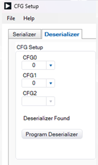

# Setup Guide: Video Grabber (HDMI) - ADI GMSL Deserializer (MAX96792A-BCK-EVK#)

## Enabling I2C Passthrough
ADI GMSL serializer and deserializer bulid-in two I2C/UART channels for local and remote peripheral control. Attach 0R resistors on R75, R76 and R77 or simply shorting the connection.

## CFG PIN Settings
1. Connect the serializer board to PC through USB and power up with 12V DC Supply.
2. Open ADI GMSL SerDes GUI on PC. In the main GUI, select **Tools** > **Other Config** > **SET CFG Pin Levels**.
3. if the Seriallizer is connected to STP cable, set CFG0 = 0 and CFG1 = 0, and click **Program Deserializer**  
   (I2C Mode, Address 0x80, RoR; STP, 6Gbps, NRZ, Tunnel Mode)  
   if the Seriallizer is connected to Coaxial cable, set CFG0 = 0 and CFG1 = 4, and click **Program Deserializer**  
   (I2C Mode, Address 0x80, RoR; Coaxial, 6Gbps, NRZ, Tunnel Mode) 

     

   For more details of CFG Pin Settings, refer to:
   - [MAX96792A: Dual GMSL3/2 to CSI-2 Deserializer Data Sheet ](hhttps://www.analog.com/media/en/technical-documentation/data-sheets/max96792a.pdf), and 
   - [UG-2233: MAX96792A Dual GMSL3 to CSI-2 Deserializer User Guide](https://www.analog.com/media/en/technical-documentation/user-guides/max96792a-device-specific-user-guide.pdf)  
4. After Programming the config pins, user need to cycle power and restart GUI to enable new settings
5. On the ADI Deserializer CSI-2 to GMSL Adapter, select S1 to VDD -> CAM 1. For detail, refer to [AD-GMSLCAMRPI-ADP# Schematics](https://wiki.analog.com/_media/resources/eval/user-guides/02_075922a_top.pdf)
6. Attach the ADI Deserializer CSI-2 to GMSL Adapter for interfacing with Ti180J484-DK
