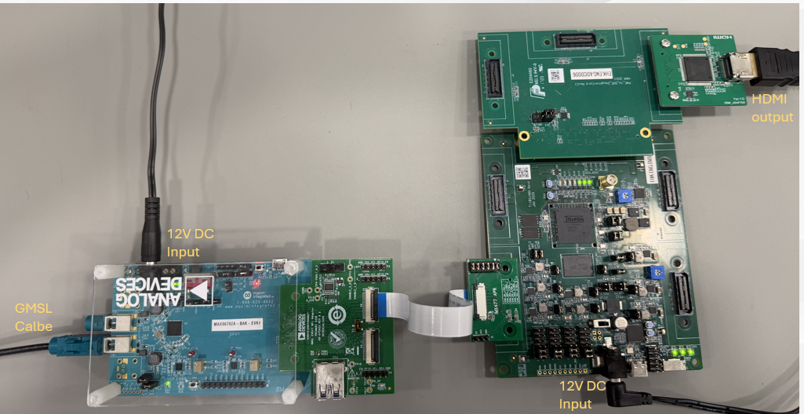
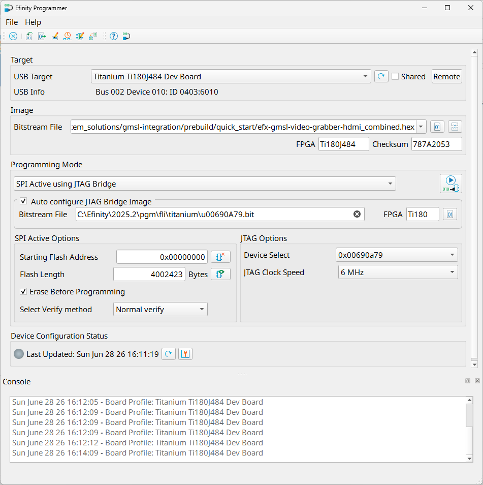

# Setup Guide: Video Grabber (HDMI) - Ti180J484-DK (Board #2)

This document explains how to set up the Titanium Ti180J484 Development Board with the Video Grabber (HDMI). 

## Required Hardware
- [Titanium&#8482; Ti180J484-DK](https://www.efinixinc.com/products-devkits-titaniumti180j484.html)
  - Titanium&#8482; Ti180J484 Development Board
  - IMX477 Camera Connector Daughter Card
  - [FMC-to-QSE Adapter Card (Rev. C)](https://www.efinixinc.com/support/docsdl.php?s=ef&pn=FMC-QSE-DC-UG)
  - [HDMI Connector Daughter Card](https://www.efinixinc.com/support/docsdl.php?s=ef&pn=HDMI-DC-UG)
- [ADI MAX96792A DPHY Evaluation Kit (GMSL2/3 De-serializer, CSI-2, P/N: MAX96792A-BCK-EVK#)](https://www.analog.com/en/resources/evaluation-hardware-and-software/evaluation-boards-kits/max96716evkit.html)
- 22-pin FFC Cable (Type A) - *The FFC cable come with GMSL Evalution Kit Adapter Board (Type B) does not fit*

## Stey-by-step Instruction

1. **Prepare the daughter cards**  
   - Connector the HDMI Connector Daughter Card with monitor. And attach onto FMC-to-QSE Adpater Card **J1**

2. **Insert the adapter cards onto the Ti180J484 Development Board**  
   - Attach the FMC-to-QSE Adapter Card onto the Ti180J484 development board **J5**.  

3. **Connect the ADI GMSL Deserializer EVK**  
   - Use 22-pin FFC Cable (Type A) to connect IMX477 Camera Connector Daughter Card (**FPC1**, bottom connecter) with the ADI GMSL Deserializer EVK (Adapter: **P8**) and insert it on to Ti180J484 Development Board **P1**.  
   - See [Setup Guide: Video Grabber (HDMI) - ADI GMSL Deserializer (MAX96792A-BCK-EVK#)](setup_gmsl-deserializer_max96792a-bck-evk.md)

4. **Configure jumper settings**  
   ### Ti180J484 Development Board
   | **Header**                      | **Jumper Conneciton**   |
   |---------------------------------|-------------------------|
   | J9, PT10                        | NC                      |
   | J10, J11, J12, J13, PT1, PT17   | 1‑2 and 3‑4             |
   | PT2–PT16                        | 1‑2                     |  

   ### FMC-to-QSE Adapter Card
   | **Header**   | **Jumper Conneciton**   |
   |--------------|-------------------------|
   | J5           | 5-6 and 7-8             |

   The final hardware setup as shown below:  
     

5. **FPGA Configuration**  
   To configure the FPGA logic design:
   - Connect the Ti180J484-DK with PC using USB Type-C cable and power on.
   - Open Efinity Programmer and select the USB Target (i.e. Titanium Ti180 J484 Development Board)
   - Select "SPI Active using JTAG Bridge" for Programming Mode
   - Choose the efx-gmsl-video-grabber-hdmi_combined.hex in prebuild/quickstart folder (from release build)
   - Make sure that the Starting Flash Address is set to 0x00000000
   - Click the "Start Programming" Icon to start the programming process  
     
   
   - For details for using Efinity Programmer, check out [Efinity Programmer User Guide](https://www.efinixinc.com/support/docsdl.php?s=ef&pn=UG-EFN-PGM)  
