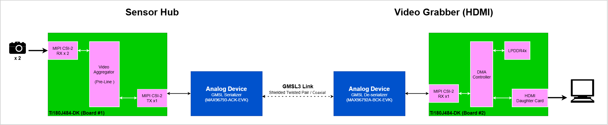
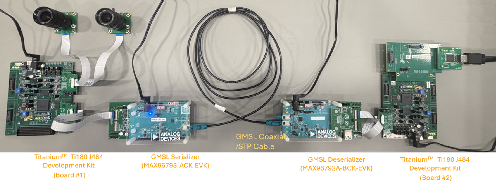
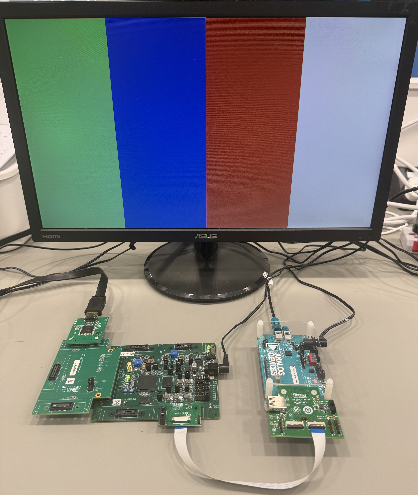

# GMSL Integration : Per-Line Mode 2x4K

# Table of Contents
* [Overview](#overview)
* [Getting Started](#getting-start)
   * [Configuring GMSL Sensor Hub](#configuring-gmsl-sensor-hub)
   * [Configuring GMSL Video Grabber (HDMI)](#configuring-gmsl-video-grabber-hdmi)
  * [Running Video Streaming Demo](#running-video-streaming-demo)
* [Result](#result)
  * [Sensor Hub User IO Behavior (Board #1)](#sensor-hub-user-io-behavior-board-1)
  * [Video Grabber User IO Behavior (Board #2)](#video-grabber-user-io-behavior-board-2)
  * [Video Display Output](#video-display-output)

# Overview

# Getting Started
### Configuring GMSL Sensor Hub (2 IMX477 Cameras)
* [Setup Guide: GMSL Sensor Hub - Ti180J484-DK (Board #1)](efx-gmsl-sensorhub-line-4cam/ti180j484-dk/docs/setup_sensor-hub-4cam_ti180j484-dk.md)
* [Setup Guide: GMSL Sensor Hub - ADI GMSL Serializer (MAX96793-ACK-EVK#)](efx-gmsl-sensorhub-line-4cam/ti180j484-dk/docs/setup_gmsl-serializer_max96793-ack-evk.md)
### Configuring GMSL Video Grabber (HDMI)
* [Setup Guide: Video Grabber (HDMI) - Ti180J484-DK (Board #2)](efx-gmsl-video-grabber-line-hdmi/ti180j484-dk/docs/setup_video-grabber-hdmi_ti180j484-dk.md)
* [Setup Guide: Video Grabber (HDMI) - ADI GMSL Deserializer (MAX96792A-BCK-EVK#)](efx-gmsl-video-grabber-line-hdmi/ti180j484-dk/docs/setup_gmsl-deserializer_max96792a-bck-evk.md)
### Running Video Streaming Demo
Once all the kits are configured properly, follow the steps below to start the video streaming demonstration:
1. Connect the Sensor Hub Serializer and Video Grabber Deserializer using a GMSL cable, and connect a monitor with HDMI cable.  

2. Turn on the power in this sequence: 
    - ADI Serializer EVK
    - ADI Deserializer EVK
     - Titanium&#8482; Ti180J484-DK (Sensor Hub, Board #1)
     - Once color bar is shown on monitor, turn on Titanium&#8482; Ti180J484-DK (Video Grabber, Board #2)
      
      

# Result

### Sensor Hub User IO Behavior (Board #1)
* SW4: System reset
* LED7: Initialization done
* LED3-4: Camera 0-1 streaming video

### Video Grabber User IO Behavior (Board #2)
* The Video View would be shown on 1920x1080 output, which would be the cropped center of the camera image @ 3840x2160. 
* SW4: Video mode switching: CAM0 -> CAM1 -> CAM2 -> CAM3 -> Split-screen (4 CAM multi-view ) -> Split-screen ( multi-view CAM0 and CAM1 ) -> Split-screen ( multi-view CAM2 and CAM3 ) -> CAM0 -> ...
* With the daughter cards attached to the QSE connectors **P1** on the Ti180J484 development board, the view of the cameras will be shown on CAM0 and CAM1. 
* LED7: Initialization done
* LED3: Receiving data from GMSL link

### Video Display Output

